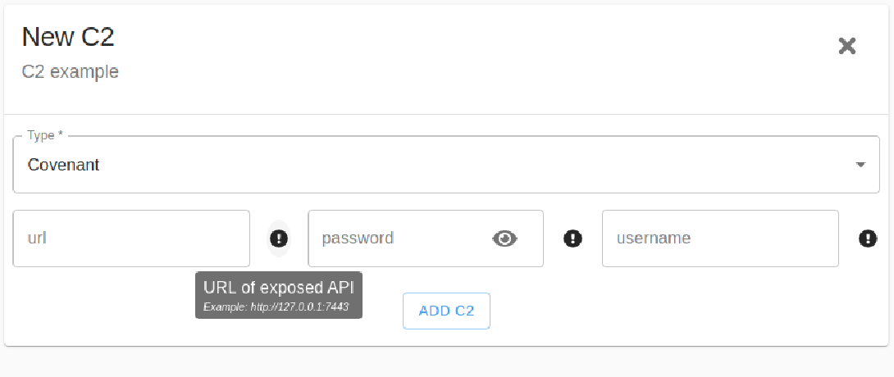

# Integrating C2s

## Class Handlers

Class handlers are the core of every new Zuthaka integration. These represent the base functionality and [contract](https://en.wikipedia.org/wiki/Design_by_contract) given by the integration. The attributes defined in the class handler frame the representation exposed in the web interface and the functions implemented in the class shape the service behavior.

### Implementing C2 Type Class handler connections:


The handlers should only provide the basic C2 interaction while managing consistency. Error tracking tasks are done by Zuthaka's service.


#### Attributes and Options Descriptions

The attributes "name", "description", "documentation", and a list of "registered\_options" is mandatory for the correct function of Zuthaka. This helps guide the user through the steps necessary to use the specific implementation.


```python
from ..c2 import C2, Listener, ListenerType, Launcher, LauncherType, Options, OptionDesc

class TemplateC2Type(C2):
    # all this information is given to the user when using the interface
    name = 'template_c2'
    description = 'this is an example C2'
    documentation = 'https://super.awesome.c2/docs/'
    registered_options = [ 
        OptionDesc(
            name='url',
            description='Url of the corresponding API',
            example='https://127.0.0.1:31337',
            field_type='string',
            required=True
        ),  
        OptionDesc(
            name='username',
            description='user owner of the API',
            example='pucara',
            field_type='string',
            required=True
        ),  
        OptionDesc(
            name='password',
            description='Url of the corresponding API',
            example='p4ssw0rd',
            field_type='string',
            required=True
        ),  
    ]


   ...

```


The descriptions of the integration helps to populate the user interface, for a guided experience.



####  Behavior Abstract Methods

The behavior is defined through the implementation of abstract methods with an specific "[contract](https://en.wikipedia.org/wiki/Design_by_contract)".

health check method: is\_alive

```python
 ...
 async def is_alive(self) -> bool:
        """ 
            This method is used to collect latency from C2, and validate connection before
            perisisting the data to Zuthaka's DB.
            
            raises ConectionError in case of not be able to connect to c2 instance
            raises ConnectionRefusedError in case of not be able to authenticate
        """
        pass

...
```


A good practice to implement "is\_alive" is to query the API for a given response. For REST APIs, generating a token is a good way to guarantee the C2 is processing the requests given through the handler.


### Implementing Listener Type Class

The Listeners are the services awaiting for connections from different Agents and generally delivering the instructions to be executed by them.

Listener Types are integrated with a similar logic that responds to the C2 API to handle Listeners.

#### Attributes and Options Descriptions

```python
....
class TemplateListenerType(ListenerType):
    name = 'http'
    description = 'standard http listener, messages are delivered in enconded comment'
    registered_options = [
        OptionDesc(
            name='useSSL',
            description='ssl enabled communication between agent and listener',
            example='false',
            field_type='string',
            required=True
        ),
        OptionDesc(
            name='bindAdress',
            description='interfaces to which the listener is bind',
            example='0.0.0.0',
            field_type='string',
            required=True
        ),
        OptionDesc(
            name='connectAddresses',
            description='address to which the agent is going to try to connect',
            example='192.168.0.14',
            field_type='string',
            required=True
        ),
        OptionDesc(
            name='connectPort',
            description='port to which the agent is going to try to connect',
            example=80,
            field_type='integer',
            required=True
        ),
    ]
...
```

#### Behavior Abstract Methods

Listeners must be able to be created and destroyed.

```python
class ListenerType(ABC):
    """ Listener Factory """

    @abstractmethod
    async def create(self, options: Options) -> 'Listener':
        """
        creates an listener on the corresponding C2 and return a Listener with listener_internal_id for the corresponding API

           raises ValueError in case of invalid dto
           raises ConectionError in case of not be able to connect to c2 instance
           raises ResourceExistsError in case of not be able to create the objectdue it already exists

         """
        pass
        
    @abstractmethod
    async def delete(self, internal_id:str, options: Options) -> None:

        """
        removes a listener from a corresponding c2 instance

           raises ValueError in case of invalid dto
           raises ConectionError in case of not be able to connect to c2 instance
           raises ResourceNotFoundError in case of not be able to remove the object due to unfound resource

        """
        pass


```

The creation or elimination of elements requires a consistency check by the class handler. This allows Zuthaka to catch at an early stage any consistency problem with the infrastructure handled.

### Implementing Launcher Type Class

The Launchers represent the capabilities of a given C2 to encapsulate the implant for later execution on the victim's machine.

#### Attributes and Options Descriptions

```python
....
class TemplateLauncherType(ListenerType):
    name = 'Powershell Launcher'
    description = 'Uses powershell.exe to launch Agent using [systemm.reflection.assemly::load()'
    registered_options = [
        OptionDesc(
            name='Dotnet Version',
            description='version of dotnet in which the launcher is going to take place',
            example='Net35',
            field_type='string',
            required=True
        ),
    ]
...
```

####  Behavior Abstract Methods

```python
   ...
     async def create_launcher(self, dto: Dict[str, Any]) -> str:
        """
        creates a laucnher on the corresponding C2 and return an launcher_internal_id raises ValueError in case of invalid dto
           raises ConectionError in case of not be able to connect to c2 instance
           raises ResourceExistsError in case of not be able to create the objectdue it already exists

        """
        pass
        
    async def download_launcher(self, dto: Dict[str, Any]) -> bytes:
        """
        retrives a created launcher using an launcher_internal_id
           raises ValueError in case of invalid dto
           raises ConectionError in case of not be able to connect to c2 instance
           raises ResourceNotFoundError 
        """
...
```

### Implementing Agent Type Class

Agents are controlled victim's machines. The integration of Agents on Zuthaka allows the user to manage the computer through the UI.

####  Behavior Abstract Methods

```python

class TemplateAgent(AgentType):

    async def retreive_agents(self, dto: Dict[str, Any]) -> bytes:
        """
        retrives all available Agents on the  given C2
           raises ValueError in case of invalid dto
           raises ConectionError in case of not be able to connect to c2 instance
           raises ResourceNotFoundError 

        [*] EXAMPLES 

        dto = {
            'c2_type' :'EmpireC2Type',
            'c2_options': {
                    "url": "https://127.0.0.1:7443",
                    "username": "cobbr",
                    "password": "NewPassword!"
                },
              'listeners_internal_ids' : ['1','2','3'] 
              }
        """

        pass

    async def shell_execute(self, dto: Dict[str, Any]) -> bytes:
        """
        executes a command string on the 
           raises ValueError in case of invalid dto
           raises ConectionError in case of not be able to connect to c2 instance
           raises ResourceNotFoundError 

        """
        pass

```

