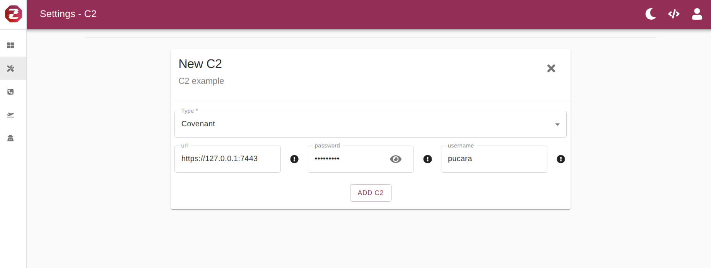

# Usage

Zuthaka facilitates centralized management of different C2s, listeners, launchers, and agents in a single interface. A [handler class](integrating-c2s.md) also needs to be been implemented in order for the management to be possible. The set up and management of each can be seen below.

### C2 Management

Instantiate a connection to a desired C2. Note that there needs to be a handler.


A [handler class](integrating-c2s.md) represents the way Zuthaka manages a given C2 to accomplish certain tasks


The options available to configure are generated by the definitions on the handler. These options are the parameters required by the handler to guarantee the functionality needed by Zuthaka's API.

### Listeners Management

The listener types are defined in the corresponding handlers class.


The Listeners generally binds a port in a given network interface available on the C2 instance


### Launchers Management

Launcher options can also be defined through the handler class


The launchers integrated with Zuthaka allows the user to retrieve the payload from the original C2.


### Agents Management

The agents connected to a given listener are collected and can be controlled by different advance UI capabilities: Shell, File Manager, Process Manager, Post Exploitation modules.


Zuthaka processes asynchronously every task generated through the agent's management interface.


If implemented in the given handler class, the file manager allows the agent to upload and download files to the victim's machine.

The process manager gives the user an interactive way of monitoring the processes on the victim's machine.

In a similar and generic integration with the different C2, the post-exploitation modules integrated with Zuthaka allows the user to run post-exploitation modules.

## 

